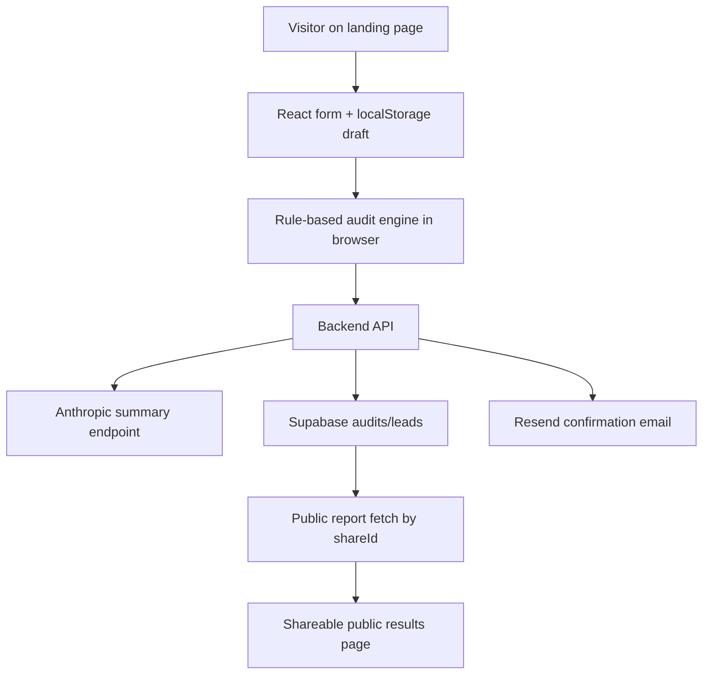

# Architecture

## System Diagram

## Data Flow

1. A visitor lands on the app and enters AI tools, plans, monthly spend, seat count, team size, and primary use case.
2. The frontend persists draft form state in `localStorage` so the input survives reloads.
3. On submit, the rule-based audit engine calculates rightsizing, tool-switch, and credit-based savings recommendations directly in the browser.
4. The frontend sends the audit result to the backend for summary generation and persistence.
5. The backend generates an AI summary if Anthropic credentials are present, otherwise it returns a deterministic fallback summary.
6. The backend stores the audit in Supabase when configured, or in local JSON for local development fallback.
7. The backend returns a public share URL keyed by `shareId`.
8. If the user submits an email, the backend stores the lead, applies basic abuse protection, and optionally sends a transactional confirmation email.
9. Public report pages fetch audit data from the backend by `shareId`, without exposing private lead data.

## Why This Stack

- React + Vite: simple React-only frontend, fast iteration, easy deployment to static hosting.
- TypeScript: catches schema and integration mistakes across frontend and backend.
- Express backend: small API surface for summary generation, audit saving, lead capture, and public report retrieval.
- Supabase: practical hosted Postgres path with low setup overhead for a take-home assignment.
- Vitest: lightweight testing setup focused on the audit engine, which is the most important logic in the product.

## If This Needed 10k Audits / Day

- Move audit persistence fully to Supabase/Postgres with stricter indexing and audit/lead analytics tables.
- Put the backend behind a proper deployment target with structured logging and environment-specific configuration.
- Add a queue for AI summary generation and transactional email work so the save path stays responsive.
- Replace in-memory rate limiting with Redis or a durable edge rate limiter.
- Add result caching and generated Open Graph image support for public share pages.
